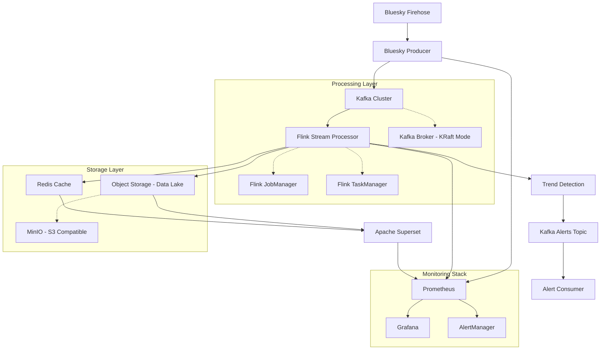

# Design Document

## Overview

The Bluesky Streaming Pipeline is a real-time data processing system that ingests social media posts from Bluesky's ATProto firehose, processes them through Apache Kafka and Flink, and detects trending topics using sliding time windows. The architecture follows event-driven patterns with clear separation between data ingestion, stream processing, and trend detection.

## Architecture

### High-Level Architecture



### Data Flow

1. **Ingestion Layer**: Bluesky Producer connects to ATProto firehose and streams posts to Kafka
2. **Message Broker**: Kafka provides reliable, partitioned message delivery
3. **Stream Processing**: Flink consumes from Kafka, applies windowing, and performs aggregations
4. **Data Lake Storage**: Raw and processed data stored in MinIO (S3-compatible object storage)
5. **Caching Layer**: Redis caches frequently accessed trend data and aggregations
6. **Trend Detection**: Statistical analysis identifies trending keywords and topics
7. **Real-time Alerts**: Trend alerts published to Kafka topics for immediate consumption
8. **BI & Visualization**: Apache Superset provides dashboards and reports from cached data
9. **Monitoring**: Prometheus collects metrics, Grafana visualizes system health

## Components and Interfaces

### Data Lake & Storage Layer

**Purpose**: Scalable object storage for raw and processed data with S3-compatible interface

**Key Components**:
```python
from typing import List, Dict, Any
from datetime import datetime
import boto3

class DataLakeManager:
    def __init__(self, endpoint_url: str, access_key: str, secret_key: str) -> None
    async def store_raw_posts(self, posts: List[PostData], partition_date: datetime) -> None
    async def store_trend_aggregations(self, trends: List[TrendAlert], window_time: datetime) -> None
    def get_partition_path(self, date: datetime, data_type: str) -> str
    async def query_historical_trends(self, start_date: datetime, end_date: datetime) -> List[Dict[str, Any]]

class CacheLayer:
    def __init__(self, redis_host: str, redis_port: int) -> None
    async def cache_current_trends(self, trends: List[TrendAlert], ttl: int = 300) -> None
    async def get_trending_keywords(self, limit: int = 50) -> List[Dict[str, Any]]
    async def cache_user_metrics(self, user_stats: Dict[str, Any]) -> None
    async def invalidate_expired_trends(self) -> None
```

**Storage Structure**:
- **Raw Data**: `s3://data-lake/raw/posts/year=2024/month=12/day=09/hour=14/`
- **Processed Data**: `s3://data-lake/processed/trends/year=2024/month=12/day=09/hour=14/`
- **Cache Keys**: `trends:current`, `trends:hourly:{timestamp}`, `users:active:{window}`

### Business Intelligence & Visualization

**Purpose**: Apache Superset for creating dashboards and reports from cached and stored data

**Key Features**:
```python
class SupersetIntegration:
    def setup_redis_dataset(self) -> None  # Connect to Redis for real-time data
    def setup_s3_dataset(self) -> None     # Connect to MinIO for historical analysis
    def create_trend_dashboard(self) -> None
    def create_user_activity_dashboard(self) -> None
    def setup_automated_reports(self) -> None

class DashboardMetrics:
    # Real-time metrics from Redis
    current_trending_topics: List[str]
    posts_per_minute: float
    active_users_count: int
    
    # Historical metrics from Data Lake
    daily_trend_patterns: Dict[str, List[float]]
    user_growth_trends: List[Dict[str, Any]]
    content_volume_analysis: Dict[str, float]
```

### Monitoring & Observability

**Purpose**: Comprehensive monitoring with Prometheus metrics collection and Grafana visualization

**Key Components**:
```python
from prometheus_client import Counter, Histogram, Gauge
from typing import Dict, Any

class MetricsCollector:
    # Application metrics
    posts_processed_total: Counter
    trend_detection_latency: Histogram
    active_trends_gauge: Gauge
    kafka_lag_gauge: Gauge
    
    def record_post_processed(self) -> None
    def record_trend_detection_time(self, duration_seconds: float) -> None
    def update_active_trends_count(self, count: int) -> None
    def update_kafka_consumer_lag(self, lag: int) -> None

class AlertingRules:
    def setup_high_latency_alert(self, threshold_ms: int) -> None
    def setup_kafka_lag_alert(self, max_lag: int) -> None
    def setup_data_lake_storage_alert(self, max_usage_percent: float) -> None
    def setup_trend_anomaly_detection(self) -> None
```

### Bluesky Producer Service

**Purpose**: Connects to Bluesky firehose and publishes posts to Kafka

**Key Classes**:
```python
from typing import Optional, List, Any
from dataclasses import dataclass
from datetime import datetime

class BlueskyFirehoseClient:
    async def connect_to_firehose(self) -> None
    async def process_commit(self, commit: Any) -> None
    async def extract_post_data(self, record: Any) -> PostData
    async def handle_reconnection(self, cursor: Optional[str] = None) -> None

class KafkaPostProducer:
    async def publish_post(self, post: PostData) -> None
    def get_partition_key(self, post: PostData) -> str
    async def handle_retry_with_backoff(self, post: PostData) -> None
```

**Configuration**:
- Kafka bootstrap servers
- Topic names and partitioning strategy
- Firehose connection parameters
- Retry and backoff policies

### Stream Processing Engine (Flink)

**Purpose**: Processes streaming posts, performs windowed aggregations, and stores results in data lake and cache

**Key Components**:
```python
from pyflink.datastream import DataStream, WindowedStream
from typing import List

class TrendDetectionJob:
    def setup_sources(self) -> DataStream
    def extract_keywords(self, post: PostData) -> List[str]
    def normalize_keywords(self, keywords: List[str]) -> List[str]
    def apply_sliding_windows(self, stream: DataStream) -> WindowedStream
    def calculate_trends(self, windowed_data: WindowedStream) -> DataStream
    def setup_checkpointing(self) -> None
    def setup_data_lake_sink(self) -> None  # MinIO S3 sink
    def setup_redis_cache_sink(self) -> None  # Redis cache updates

class DataLakeWriter:
    async def write_raw_posts(self, posts: List[PostData]) -> None
    async def write_aggregated_trends(self, trends: List[TrendAlert]) -> None
    def get_partition_path(self, timestamp: datetime) -> str  # Year/month/day/hour partitioning

class RedisCacheManager:
    async def cache_trending_keywords(self, trends: List[TrendAlert]) -> None
    async def cache_user_activity(self, user_stats: Dict[str, Any]) -> None
    def set_cache_ttl(self, key: str, ttl_seconds: int) -> None
```

**Window Configuration**:
- Sliding windows: 10-minute windows, 1-minute slide
- Tumbling windows: 5-minute aggregation periods
- Session windows: For user activity analysis

**Data Sinks**:
- **Data Lake**: Parquet files partitioned by date/hour in MinIO
- **Cache Layer**: Real-time trend data and user statistics in Redis
- **Alert Stream**: High-velocity trends to Kafka for immediate action

### Trend Detection Algorithm

**Purpose**: Identifies trending keywords using statistical analysis

**Algorithm Components**:
1. **Keyword Extraction**: NLP processing to extract meaningful terms
2. **Frequency Counting**: Sliding window frequency analysis
3. **Trend Scoring**: Statistical significance testing
4. **Ranking**: Sort trends by velocity and absolute frequency

**Trend Criteria**:
- Minimum frequency threshold (configurable)
- Growth rate compared to historical baseline
- Statistical significance (z-score > 2.0)

### Data Models

#### PostData
```python
from typing import Optional, List
from dataclasses import dataclass
from datetime import datetime

@dataclass
class PostData:
    uri: str
    author_did: str  # Bluesky DID identifier
    text: str
    created_at: datetime
    language: Optional[str] = None
    reply_to: Optional[str] = None
    mentions: List[str] = None
    hashtags: List[str] = None
    
    def __post_init__(self) -> None:
        if self.mentions is None:
            self.mentions = []
        if self.hashtags is None:
            self.hashtags = []
```

#### TrendAlert
```python
@dataclass
class TrendAlert:
    keyword: str
    frequency: int
    growth_rate: float
    confidence_score: float
    window_start: datetime
    window_end: datetime
    sample_posts: List[str]
    unique_authors: int
    rank: int  # Ranking among current trends
```

#### WindowedKeywordCount
```python
@dataclass
class WindowedKeywordCount:
    keyword: str
    count: int
    window_start: datetime
    window_end: datetime
    unique_authors: int
    normalized_keyword: str  # Processed version for matching
```

## Error Handling

### Connection Resilience
- **Firehose Disconnection**: Exponential backoff reconnection with cursor resumption
- **Kafka Unavailability**: Producer retry logic with local buffering
- **Flink Job Failures**: Automatic restart with checkpointing recovery

### Data Quality
- **Malformed Messages**: Skip and log invalid ATProto messages
- **Encoding Issues**: Handle various text encodings gracefully
- **Missing Fields**: Use default values for optional post fields

### Monitoring and Alerting
- **Health Checks**: HTTP endpoints for service health monitoring
- **Metrics Collection**: Prometheus scrapes metrics from all services
- **Visualization**: Grafana dashboards for system performance and business metrics
- **Alerting**: AlertManager handles notifications for system issues and trend anomalies
- **Error Tracking**: Structured logging with correlation IDs
- **Data Quality Monitoring**: Automated checks for data completeness and freshness

## Testing Strategy

### Unit Testing
- **Producer Logic**: Mock ATProto client and test message processing
- **Kafka Integration**: Use embedded Kafka for producer/consumer tests
- **Trend Detection**: Test algorithms with synthetic data sets

### Integration Testing
- **End-to-End Flow**: Docker Compose test environment
- **Performance Testing**: Load testing with simulated firehose data
- **Failure Scenarios**: Network partitions, service restarts

### Test Data
- **Synthetic Posts**: Generated posts with known trending patterns
- **Historical Data**: Replay of actual Bluesky firehose data
- **Edge Cases**: Empty posts, very long posts, special characters

## Deployment Configuration

### Docker Compose Services

#### Infrastructure Services
```yaml
services:
  # Message Streaming
  kafka:
    image: confluentinc/cp-kafka:latest
    environment:
      KAFKA_PROCESS_ROLES: 'broker,controller'
      KAFKA_NODE_ID: 1
      KAFKA_CONTROLLER_QUORUM_VOTERS: '1@kafka:29093'
      KAFKA_LISTENERS: 'PLAINTEXT://kafka:29092,CONTROLLER://kafka:29093,PLAINTEXT_HOST://0.0.0.0:9092'
      KAFKA_ADVERTISED_LISTENERS: 'PLAINTEXT://kafka:29092,PLAINTEXT_HOST://localhost:9092'
      KAFKA_CONTROLLER_LISTENER_NAMES: 'CONTROLLER'
      KAFKA_LISTENER_SECURITY_PROTOCOL_MAP: 'CONTROLLER:PLAINTEXT,PLAINTEXT:PLAINTEXT,PLAINTEXT_HOST:PLAINTEXT'
      KAFKA_INTER_BROKER_LISTENER_NAME: 'PLAINTEXT'
      KAFKA_OFFSETS_TOPIC_REPLICATION_FACTOR: 1
      KAFKA_GROUP_INITIAL_REBALANCE_DELAY_MS: 0
      KAFKA_TRANSACTION_STATE_LOG_MIN_ISR: 1
      KAFKA_TRANSACTION_STATE_LOG_REPLICATION_FACTOR: 1
      KAFKA_LOG_DIRS: '/tmp/kraft-combined-logs'
    
  # Stream Processing
  flink-jobmanager:
    image: flink:latest
    command: jobmanager
    environment:
      - |
        FLINK_PROPERTIES=
        jobmanager.rpc.address: flink-jobmanager
        taskmanager.numberOfTaskSlots: 2
        parallelism.default: 2
    
  flink-taskmanager:
    image: flink:latest
    command: taskmanager
    depends_on: [flink-jobmanager]
    environment:
      - |
        FLINK_PROPERTIES=
        jobmanager.rpc.address: flink-jobmanager
        taskmanager.numberOfTaskSlots: 2
        
  # Data Lake Storage
  minio:
    image: minio/minio:latest
    command: server /data --console-address ":9001"
    environment:
      MINIO_ROOT_USER: minioadmin
      MINIO_ROOT_PASSWORD: minioadmin123
    ports:
      - "9000:9000"
      - "9001:9001"
    volumes:
      - minio_data:/data
      
  # Caching Layer
  redis:
    image: redis:alpine
    ports:
      - "6379:6379"
    command: redis-server --appendonly yes
    volumes:
      - redis_data:/data
      
  # Business Intelligence
  superset:
    image: apache/superset:latest
    depends_on: [redis, minio]
    ports:
      - "8088:8088"
    environment:
      SUPERSET_CONFIG_PATH: /app/superset_config.py
    volumes:
      - ./config/superset_config.py:/app/superset_config.py
      
  # Monitoring Stack
  prometheus:
    image: prom/prometheus:latest
    ports:
      - "9090:9090"
    volumes:
      - ./config/prometheus.yml:/etc/prometheus/prometheus.yml
      - prometheus_data:/prometheus
      
  grafana:
    image: grafana/grafana:latest
    depends_on: [prometheus]
    ports:
      - "3000:3000"
    environment:
      GF_SECURITY_ADMIN_PASSWORD: admin123
    volumes:
      - grafana_data:/var/lib/grafana
      - ./config/grafana/dashboards:/etc/grafana/provisioning/dashboards
      
  alertmanager:
    image: prom/alertmanager:latest
    ports:
      - "9093:9093"
    volumes:
      - ./config/alertmanager.yml:/etc/alertmanager/alertmanager.yml

volumes:
  minio_data:
  redis_data:
  prometheus_data:
  grafana_data:
```

#### Application Services
```yaml
  bluesky-producer:
    build: ./services/bluesky-producer
    depends_on: [kafka]
    environment:
      - KAFKA_BOOTSTRAP_SERVERS=kafka:9092
      
  trend-processor:
    build: ./services/trend-processor
    depends_on: [flink-jobmanager, kafka]
```

### Resource Allocation
- **Kafka (KRaft)**: 2GB memory, 2 CPU cores, persistent volumes for logs
- **Flink**: JobManager (1GB), TaskManager (2GB per instance)
- **MinIO**: 1GB memory, 1 CPU core, persistent volumes for object storage
- **Redis**: 512MB memory, 1 CPU core, persistent volumes for cache
- **Superset**: 1GB memory, 1 CPU core for BI dashboards
- **Prometheus**: 512MB memory, 1 CPU core, persistent volumes for metrics
- **Grafana**: 256MB memory, 0.5 CPU core for visualization
- **Producer Services**: 512MB memory, 1 CPU core each

### Networking & Access Points
- **Kafka**: localhost:9092 (broker), internal kafka:29092
- **Flink UI**: localhost:8081 (JobManager web interface)
- **MinIO Console**: localhost:9001 (admin interface), localhost:9000 (S3 API)
- **Redis**: localhost:6379 (cache access)
- **Superset**: localhost:8088 (BI dashboards)
- **Prometheus**: localhost:9090 (metrics collection)
- **Grafana**: localhost:3000 (monitoring dashboards)
- **AlertManager**: localhost:9093 (alert management)
- **Health Endpoints**: HTTP health checks on standard ports for all services

## Performance Considerations

### Throughput Optimization
- **Kafka Partitioning**: Partition by author DID for balanced load
- **Batch Processing**: Configure appropriate batch sizes for latency vs throughput
- **Parallel Processing**: Scale Flink TaskManagers based on load

### Memory Management
- **Flink State**: Use RocksDB state backend for large state, checkpoints to MinIO
- **Kafka Retention**: Configure topic retention based on storage capacity
- **Redis Memory**: Configure eviction policies for cache optimization
- **MinIO Storage**: Lifecycle policies for data archival and cleanup
- **JVM Tuning**: Optimize garbage collection for streaming workloads

### Scalability Design
- **Horizontal Scaling**: Add Kafka partitions and Flink TaskManagers
- **State Partitioning**: Distribute trend detection state across parallel operators
- **Cache Scaling**: Redis clustering for high-availability caching
- **Storage Scaling**: MinIO distributed mode for large-scale object storage
- **BI Scaling**: Superset load balancing for multiple dashboard users
- **Resource Monitoring**: Prometheus-based auto-scaling triggers via Grafana alerts