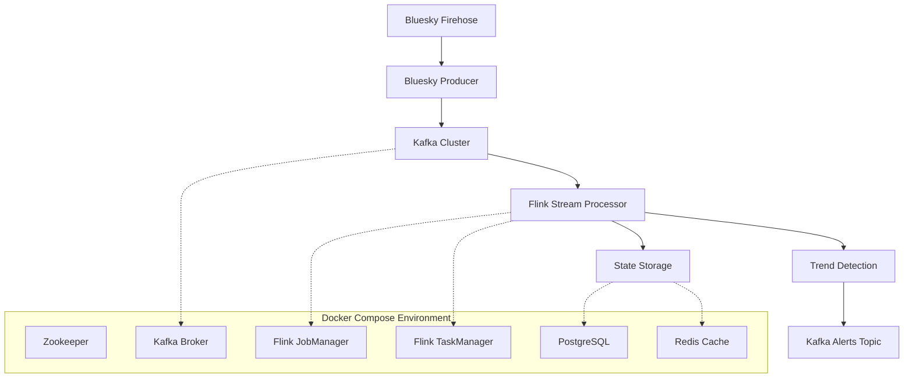

# Design Document

## Overview

The Bluesky Streaming Pipeline is a real-time data processing system that ingests social media posts from Bluesky's ATProto firehose, processes them through Apache Kafka and Flink, and detects trending topics using sliding time windows. The architecture follows event-driven patterns with clear separation between data ingestion, stream processing, and trend detection.

## Architecture

### High-Level Architecture



### Data Flow

1. **Ingestion Layer**: Bluesky Producer connects to ATProto firehose and streams posts to Kafka
2. **Message Broker**: Kafka provides reliable, partitioned message delivery
3. **Stream Processing**: Flink consumes from Kafka, applies windowing, and performs aggregations
4. **Trend Detection**: Statistical analysis identifies trending keywords and topics
5. **Output**: Trend alerts published to Kafka topics for downstream consumption

## Components and Interfaces

### Bluesky Producer Service

**Purpose**: Connects to Bluesky firehose and publishes posts to Kafka

**Key Classes**:
```python
from typing import Optional, List, Any
from dataclasses import dataclass
from datetime import datetime

class BlueskyFirehoseClient:
    async def connect_to_firehose(self) -> None
    async def process_commit(self, commit: Any) -> None
    async def extract_post_data(self, record: Any) -> PostData
    async def handle_reconnection(self, cursor: Optional[str] = None) -> None

class KafkaPostProducer:
    async def publish_post(self, post: PostData) -> None
    def get_partition_key(self, post: PostData) -> str
    async def handle_retry_with_backoff(self, post: PostData) -> None
```

**Configuration**:
- Kafka bootstrap servers
- Topic names and partitioning strategy
- Firehose connection parameters
- Retry and backoff policies

### Stream Processing Engine (Flink)

**Purpose**: Processes streaming posts and performs windowed aggregations

**Key Components**:
```python
from pyflink.datastream import DataStream, WindowedStream
from typing import List

class TrendDetectionJob:
    def setup_sources(self) -> DataStream
    def extract_keywords(self, post: PostData) -> List[str]
    def normalize_keywords(self, keywords: List[str]) -> List[str]
    def apply_sliding_windows(self, stream: DataStream) -> WindowedStream
    def calculate_trends(self, windowed_data: WindowedStream) -> DataStream
    def setup_checkpointing(self) -> None
```

**Window Configuration**:
- Sliding windows: 10-minute windows, 1-minute slide
- Tumbling windows: 5-minute aggregation periods
- Session windows: For user activity analysis

### Trend Detection Algorithm

**Purpose**: Identifies trending keywords using statistical analysis

**Algorithm Components**:
1. **Keyword Extraction**: NLP processing to extract meaningful terms
2. **Frequency Counting**: Sliding window frequency analysis
3. **Trend Scoring**: Statistical significance testing
4. **Ranking**: Sort trends by velocity and absolute frequency

**Trend Criteria**:
- Minimum frequency threshold (configurable)
- Growth rate compared to historical baseline
- Statistical significance (z-score > 2.0)

### Data Models

#### PostData
```python
from typing import Optional, List
from dataclasses import dataclass
from datetime import datetime

@dataclass
class PostData:
    uri: str
    author_did: str  # Bluesky DID identifier
    text: str
    created_at: datetime
    language: Optional[str] = None
    reply_to: Optional[str] = None
    mentions: List[str] = None
    hashtags: List[str] = None
    
    def __post_init__(self) -> None:
        if self.mentions is None:
            self.mentions = []
        if self.hashtags is None:
            self.hashtags = []
```

#### TrendAlert
```python
@dataclass
class TrendAlert:
    keyword: str
    frequency: int
    growth_rate: float
    confidence_score: float
    window_start: datetime
    window_end: datetime
    sample_posts: List[str]
    unique_authors: int
    rank: int  # Ranking among current trends
```

#### WindowedKeywordCount
```python
@dataclass
class WindowedKeywordCount:
    keyword: str
    count: int
    window_start: datetime
    window_end: datetime
    unique_authors: int
    normalized_keyword: str  # Processed version for matching
```

## Error Handling

### Connection Resilience
- **Firehose Disconnection**: Exponential backoff reconnection with cursor resumption
- **Kafka Unavailability**: Producer retry logic with local buffering
- **Flink Job Failures**: Automatic restart with checkpointing recovery

### Data Quality
- **Malformed Messages**: Skip and log invalid ATProto messages
- **Encoding Issues**: Handle various text encodings gracefully
- **Missing Fields**: Use default values for optional post fields

### Monitoring and Alerting
- **Health Checks**: HTTP endpoints for service health monitoring
- **Metrics Collection**: Prometheus metrics for throughput and latency
- **Error Tracking**: Structured logging with correlation IDs

## Testing Strategy

### Unit Testing
- **Producer Logic**: Mock ATProto client and test message processing
- **Kafka Integration**: Use embedded Kafka for producer/consumer tests
- **Trend Detection**: Test algorithms with synthetic data sets

### Integration Testing
- **End-to-End Flow**: Docker Compose test environment
- **Performance Testing**: Load testing with simulated firehose data
- **Failure Scenarios**: Network partitions, service restarts

### Test Data
- **Synthetic Posts**: Generated posts with known trending patterns
- **Historical Data**: Replay of actual Bluesky firehose data
- **Edge Cases**: Empty posts, very long posts, special characters

## Deployment Configuration

### Docker Compose Services

#### Infrastructure Services
```yaml
services:
  zookeeper:
    image: confluentinc/cp-zookeeper:latest
    
  kafka:
    image: confluentinc/cp-kafka:latest
    depends_on: [zookeeper]
    
  flink-jobmanager:
    image: flink:latest
    command: jobmanager
    
  flink-taskmanager:
    image: flink:latest
    command: taskmanager
    depends_on: [flink-jobmanager]
```

#### Application Services
```yaml
  bluesky-producer:
    build: ./services/bluesky-producer
    depends_on: [kafka]
    environment:
      - KAFKA_BOOTSTRAP_SERVERS=kafka:9092
      
  trend-processor:
    build: ./services/trend-processor
    depends_on: [flink-jobmanager, kafka]
```

### Resource Allocation
- **Kafka**: 2GB memory, 2 CPU cores, persistent volumes for logs
- **Flink**: JobManager (1GB), TaskManager (2GB per instance)
- **Producer Services**: 512MB memory, 1 CPU core each

### Networking
- **Internal Network**: Docker Compose network for service communication
- **External Access**: Kafka on localhost:9092, Flink UI on localhost:8081
- **Health Endpoints**: HTTP health checks on standard ports

## Performance Considerations

### Throughput Optimization
- **Kafka Partitioning**: Partition by author DID for balanced load
- **Batch Processing**: Configure appropriate batch sizes for latency vs throughput
- **Parallel Processing**: Scale Flink TaskManagers based on load

### Memory Management
- **Flink State**: Use RocksDB state backend for large state
- **Kafka Retention**: Configure topic retention based on storage capacity
- **JVM Tuning**: Optimize garbage collection for streaming workloads

### Scalability Design
- **Horizontal Scaling**: Add Kafka partitions and Flink TaskManagers
- **State Partitioning**: Distribute trend detection state across parallel operators
- **Resource Monitoring**: Auto-scaling triggers based on CPU and memory usage